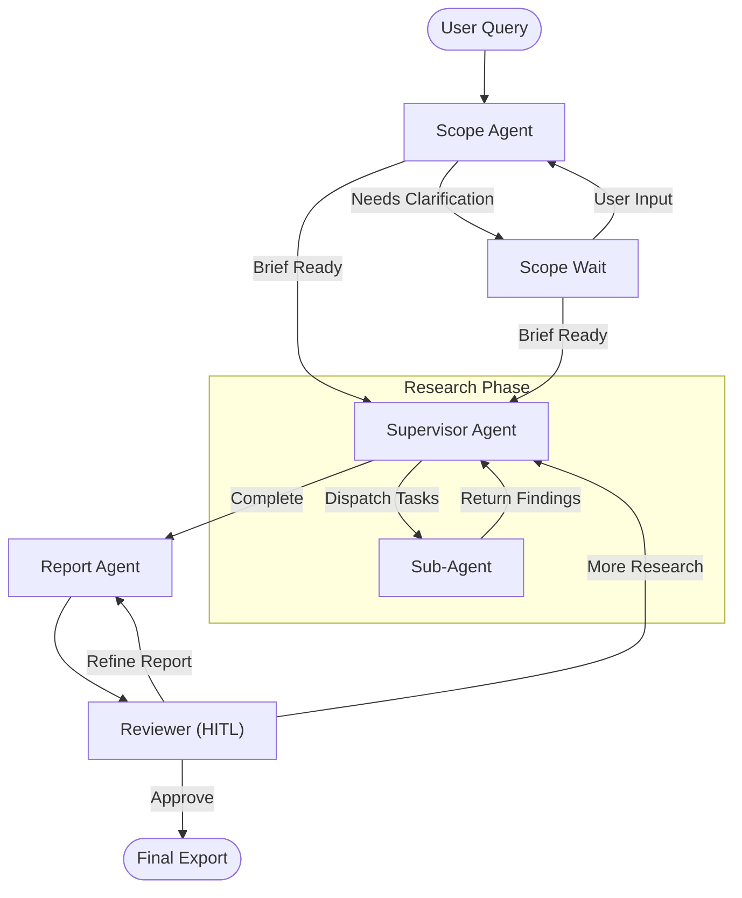

# Multi-Agent Research Assistant

An AI-powered research pipeline utilising specialised agents to find, verify, and synthesise information into structured reports. Built as a monorepo with **FastAPI**, **LangGraph**, and **Next.js**.

## Tech Stack

- **Backend:** Python 3.11, FastAPI, LangGraph, LangChain.
- **Frontend:** Next.js 14 (App Router), Tailwind CSS, Radix UI.
- **Persistence:** SQLite via `langgraph-checkpoint-sqlite`.
- **AI & Tools:** DeepSeek, OpenAI APIs, ArXiv, Semantic Scholar, PyMuPDF.

## Project Structure

- `backend/`: FastAPI server, LangGraph workflows, specialised tools, and API routes.
- `frontend/`: Next.js web application and React components.
- `.agent/rules/`: Guidelines dictating agent standard behaviours.

## Core Features

- **Specialised Agents**: Separate nodes for scope clarification, research execution, and final synthesis.
- **Traceable Citations**: Findings are tagged with source tool metadata; citations include automated author/venue extraction.
- **Human-in-the-Loop**: Interrupts for brief approval and final report review.
- **Dynamic Tasking**: Supervisor node breaks complex queries into parallel sub-tasks based on a live gap analysis.

---

## Architecture

The workflow is managed as a stateful graph:



---

## Prerequisites

Ensure the following tools are installed on your system before proceeding:

- **Python 3.11** or higher
- **Node.js** (v18.x or via `nvm`) and `npm`
- **uv** (for fast Python dependency management)

---

## Setup

### 1. Environment Configuration

You must configure credentials for both the backend and frontend. We provide `.example` files to act as templates.

**Backend (.env)**
Navigate to the `backend/` directory and copy the template:

```bash
cd backend
cp .env.example .env
```

Open `backend/.env` and securely insert your applicable keys (e.g. `DEEPSEEK_API_KEY`, `OPENAI_API_KEY`, `TAVILY_API_KEY`, etc.).

**Frontend (.env.local)**
Navigate to the `frontend/` directory and copy the template:

```bash
cd frontend
cp .env.local.example .env.local
```

Ensure `NEXT_PUBLIC_API_URL` reflects your local backend path appropriately (default is `http://localhost:8000/api/v1`).

### 2. Backend Initialisation

The backend dependencies are strictly managed with `uv` for deterministic resolution. Start the FastAPI server by executing:

```bash
cd backend
# Sync dependencies via the uv.lock constraints
uv sync
# Execute the API server
uv run uvicorn app.main:app --reload --port 8000
```

### 3. Frontend Initialisation

The Next.js application utilises Tailwind CSS and Radix UI components. Initialise the frontend by executing:

```bash
cd frontend
# Install node modules
npm install
# Start the development server
npm run dev
```

The graphical application now runs securely at `http://localhost:3000`.

---

## Workflow

1. **Input**: Submit a research topic or question.
2. **Refine**: Respond to clarifying questions requested by the Scope agent.
3. **Research**: The system deploys sub-agents to query academic and web sources in parallel.
4. **Review**: Inspect the draft report and approve it or request additional iterations.
